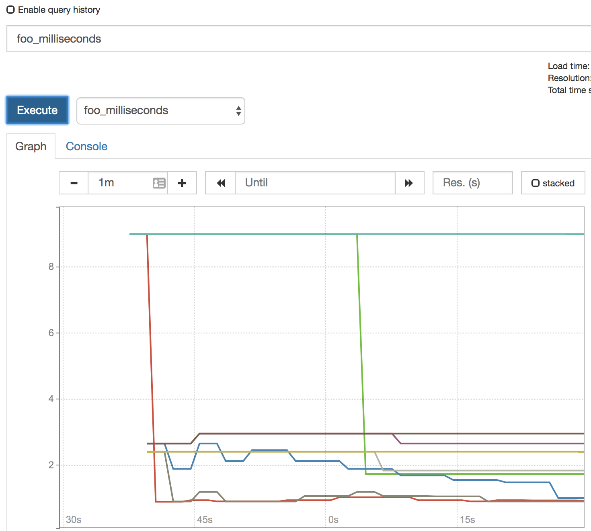
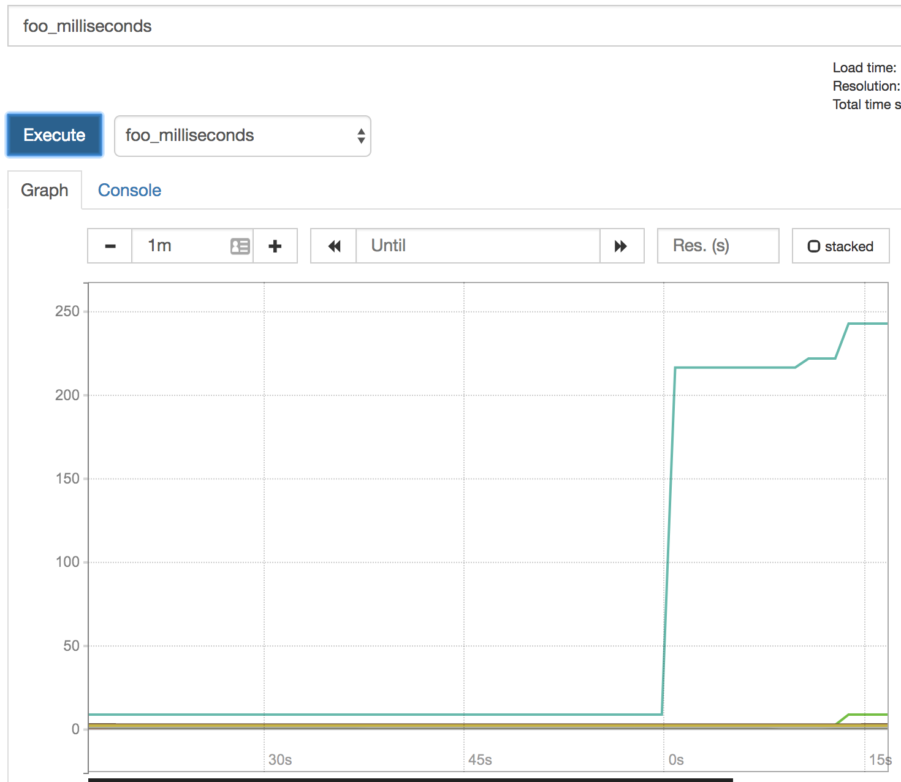

# talk-observability

The content found in this repo is for a talk on observability that will be 
presented at nidevconf 2018. The slides for this talk can be viewed [here](https://docs.google.com/presentation/d/1RXX74v_0XeNztHIH17_YuTGFHbM5VzfoPP_lf30zyRA/edit?usp=sharing).


requirements
------------

 - docker-compose version 1.17.1+
 - docker version 1.17.1+
 - free ports 9090 and 8080 (this can be changed in `docker-compose.yml`)

run
---

You can run this demonstration using docker-compose by running the following:

```sh
docker-compose build
docker-compose up
```

This should run all of the required services. You can view prometheus on 
[localhost:9090](http://localhost:9090) and you can view nginx (load balancing 
over 3 replica /api/foo services) at 
[localhost:8080/api/foo](http://localhost:8080/api/foo).

test
----

The endpoint `/api/foo` is configured to produce some metrics, visible from the
`/metrics` endpoint. By loading `/api/foo` several times, prometheus will start to 
scrape these metrics from each of the underlying docker containers.

```shell
# tip. install `watch` to repeat command, and run:
watch -n 1 curl -s http://localhost:8080/api/foo > /dev/null
# this will curl /api/foo every second
```

In prometheus you will see the metrics listed as foo_milliseconds_bucket, 
foo_milliseconds_count and foo_milliseconds_sum.

Once the apps are running you can run `./chaos.sh` to impact network on app1. Specifically, `./chaos.sh` uses [tc](https://linux.die.net/man/8/tc) to corrupt the network device in the app1 container. The impact of this should be clear for foo_milliseconds_bucket on app1, in prometheus.

You should see something similar to this pattern. Note the changing of the scale on the vertical.

**before ./chaos.sh**


**after ./chaos.sh**


caveats
-------

The majority of code in this repo is to simply make the demonstration easier for me (Peter McConnell) and does not serve to provide instruction for how you should go about building projects or learning about metrics. That said, feel free to take anything you feel is useful or ask questions about anything that's unclear.

useful links
------------

 - [prometheus.io](https://prometheus.io/)
 - [sre book](https://landing.google.com/sre/book/index.html)
 - [nidevconf](https://www.nidevconf.com/)
 - [golang tour](https://tour.golang.org/welcome/4)
 - [nginx](https://www.nginx.com/)
 - [docker](https://www.docker.com/)
 - [tc](https://linux.die.net/man/8/tc)
